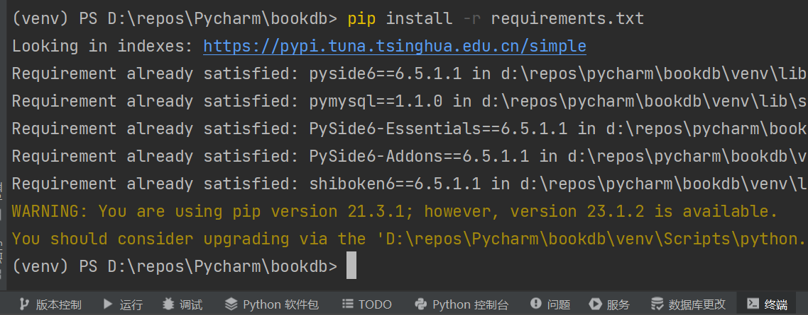
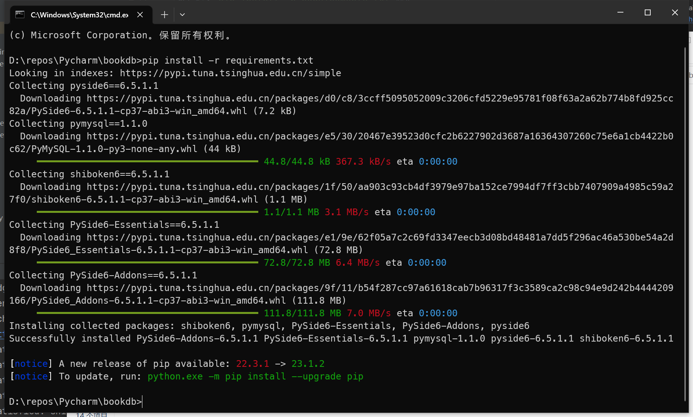
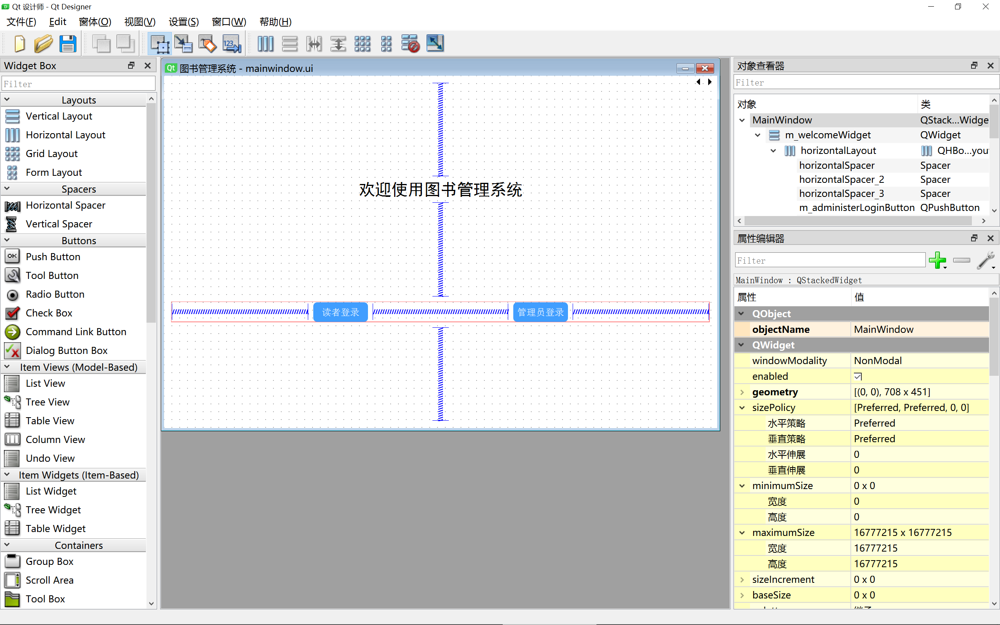
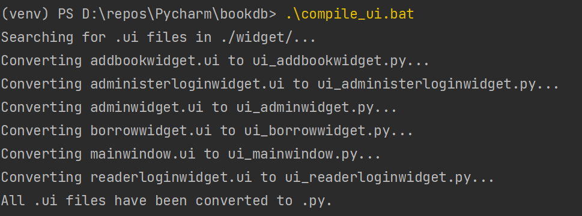

### 2023/7/3更新

上传代码后不断有人点赞并且提issue，说明这个实验课还在开。所以我把代码重构了一下，弄得稍微好看了一点。

## 一、说明

考虑到这是数据库的实验课，我用了尽量简单的方式写代码。没有任何分层架构，也没有服务器，UI直接通过SQL语句操作数据库。

UI库用的是Pyside6，数据库用的是MySQL 8.0

实验要求见`./数据库实验作业要求.docx`

## 二、如何运行

### (1) 准备环境

#### 1. 安装MySQL 8

如何安装自行百度，MySQL 8以上版本应该都可以。版本过低可能会造成pymysql不兼容

#### 2. 配置MySQL

用户名密码都设置为root，端口号设置为3306。如果你要设置自己的用户名密码和端口号，需要把代码里的也改了，在`./database/connector.py`里面。

#### 3. 配置数据库

运行`./bookdb.sql`里面的所有SQL语句。运行后会创建一个bookdb数据库，里面保存了图书管理系统需要的信息，里面初始化了一个管理员（帐号和密码都是admin）、一个用户（用户信息在sql文件里面自己找）和几本书籍

#### 4. 安装Python

如何安装Python也自行百度，我的本机环境是Python 3.10。和3.10相差不大应该也可以。

注意安装的时候一定要勾选**加入环境变量**（如果你会创建Python虚拟环境就不用）

#### 5. 配置Python

有两种方式：

+ 如果你用Python比较熟，会创建虚拟环境，看这里。不熟的话跳过这部分看下面

创建完虚拟环境之后，在你创建的虚拟环境下运行终端（我以PyCharm举例）

注意最前面的`(venv)`，这个是你创建的虚拟环境的名称，一会代码一定要在这个虚拟幻境里跑，要不然就白配置了

然后输入`pip install -r requirements.txt`回车

接下来就会自动下载安装所需要的包，如下图所示（我已经安装过了，所以显示Requirement already satisfied）

+ 如果你对Python不熟，那看这里：

在当前项目所在文件夹打开控制台，输入`pip install -r requirements.txt`回车。

如果提示`'pip' 不是内部或外部命令，也不是可运行的程序
或批处理文件。`，说明你的Python没有加入环境变量。如何加入环境变量自行百度，注意一定要把Python目录和Scripts目录都加入环境变量！！

如果你的控制台输出像下面一样就成功了。

注意最后一定要输出`Successfully installed ......`

如果没有输出这个，说明前面有报错。这种情况你可以试一下把Python**重新安装**并且版本为**3.10**，应该就不会报错了。

### (2) 运行程序

在项目目录进入控制台，输入`python main.py`回车即可。

如果你前面使用虚拟环境安装Python的包，注意一定要在虚拟环境里运行，否则会报错。

## 三、如果你想修改代码

### (1) 修改UI

`./widget/`目录下所有的`.ui`文件都是程序UI的一部分。

按照前面的说明配置好环境后，在Python的`Scripts`目录下（这个目录就是你刚刚加入环境变量的两个目录之一），有一个文件叫`pyside6-designer.exe`。

运行这个程序，在里面打开`.ui`文件即可编辑，如下图

右下角的黄色的区域就是用来调整UI的，上面的属性都是字面意思，可以自己修改试一试。

其中`styleSheet`这个属性比较重要，支持类似CSS的语法，可以很灵活的修改样式。我已经在mainwindow.ui里面写了一点styleSheet，可以参考

### (2) 编译

修改ui之后直接运行不会生效，必须先把`.ui`文件编译为`.py`文件。

在控制台运行`compile_ui.bat`脚本，如果输出如下图就编译成功。

如果编译失败，自己用记事本打开脚本，按照里面的注释修改文件地址即可

### (3) 修改数据库配置

在前面配置MySQL的时候说了

### (4) 修改其他代码需要你会Qt的语法
